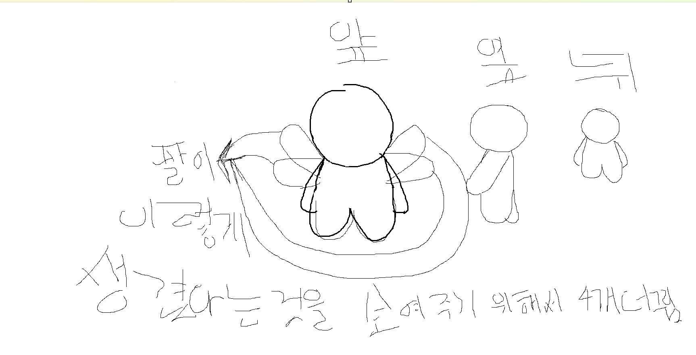

# 지식 (Knowledge) — 아트 01: 캐릭터 그림체

> 상태: 초안 (v0.3) · 출처: 기획자 스케치 (`reference/character_style_v1.png`)
> 원본 스케치를 해석한 내용은 모두 기획자 확인을 거쳤다.

## 1. 기본 방향

- 단순한 그림체 (기획자 지정)
- 3면도 제공: **앞 / 옆 / 뒤**
- 이 스케치는 **베이스 바디(마네킹)** 이다. 모든 캐릭터는 이 몸 위에 얼굴·옷 등을 덧입혀 만든다.
- 마네킹은 **기본(중립) 상태**일 뿐이다. 그 위에서 **체격 조정, 복잡한 얼굴, 화려한 의상**이 가능해야 한다 → [아트 03](03_character_customization.md)
- "단순함"은 기본 몸의 특징이며, 최종 캐릭터가 반드시 단순해야 한다는 뜻이 아니다.

## 2. 스케치에서 확인되는 형태

원본 앞모습 기준 픽셀 측정값(대략)이며, 손그림이므로 ±10% 오차를 전제로 한다.

| 부위 | 형태 | 비율 근거 |
|---|---|---|
| 머리 | 거의 완전한 원. 목 없이 몸통에 바로 붙음 | 머리 높이 ≈ 205px |
| 몸통 | 아래로 약간 넓어지는 둥근 덩어리 | 몸통+다리 높이 ≈ 200px |
| 다리 | 몸통 하단 가운데의 홈으로만 두 다리를 구분. 짧고 뭉툭함 | 다리 ≈ 몸통 높이의 40% |
| 팔 | 어깨에서 몸통 옆을 따라 늘어지는 가는 팔. 손가락 없이 끝이 안쪽으로 살짝 말림 | 손끝이 다리 시작 높이 근처 |
| 얼굴·머리카락 | 없음 (마네킹이므로 의도된 공백) | — |

**종합 비율: 머리 : 몸 ≈ 1 : 1, 전체 약 2등신.**

### 시점별 특징
- **앞**: 좌우 대칭. 팔은 몸통 양옆에 붙어 늘어짐.
- **옆**: 몸통 폭이 좁아지고, 팔이 몸 앞쪽으로 비스듬히 내려옴.
- **뒤**: 앞모습과 같은 실루엣. 팔이 몸통 양옆으로 살짝 보임.
- 세 시점 모두 **같은 크기**의 캐릭터다. 원본에서 옆·뒤가 작아 보이는 것은 작화 편차다.

## 3. 원본 스케치 읽는 법 (기획자 확인 완료)

| 원본의 표시 | 의미 |
|---|---|
| 앞모습 뒤의 반투명한 날개 모양 4개 | **날개가 아니라 팔.** 팔의 형태를 보여주려고 덧그린 참고 스케치 |
| 앞모습 머리 위의 짧은 가로선 | 단순한 선 겹침. 디자인 요소 아님 |
| 옆·뒤 모습이 작게 그려짐 | 작화 편차. 실제로는 같은 크기 |
| 얼굴·옷 없음 | 마네킹(베이스 바디)이므로 의도된 것 |

## 4. 미정 사항

- [ ] 색감(채색 방식, 외곽선 유무)
- [ ] 3D 모델로 구현할지, 2D 스프라이트로 구현할지
- [ ] 얼굴 디자인 (눈·입 표현 방식)
- [ ] 의상·장신구 디자인 (신·플레이어·NPC별)
- [ ] 신(지식의 신, 8 권속신)과 플레이어·NPC를 구분하는 방식 (크기, 장신구, 색 등)
